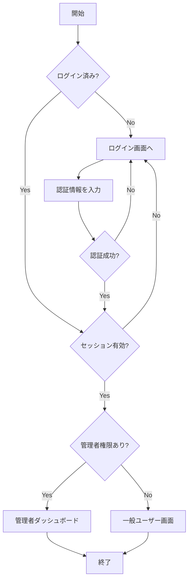

- [[Obsidian]]で[[Mermaid]]を使って作図できる
- [[Mermaid]]: 「テキスト（コード）を書くだけで図が作れる」ツール

- バッククォートで囲んだ後、mermaidを打ち込むだけで作れる
- 「```mermaid」

- 以下はサンプル


```mermaid
graph TD
    A[開始] --> B{ログイン済み?}
    B -- No --> C[ログイン画面へ]
    B -- Yes --> D{セッション有効?}
    
    C --> E[認証情報を入力]
    E --> F{認証成功?}
    F -- No --> C
    F -- Yes --> D
    
    D -- No --> C
    D -- Yes --> G{管理者権限あり?}
    
    G -- Yes --> H[管理者ダッシュボード]
    G -- No --> I[一般ユーザー画面]
    
    H --> J[終了]
    I --> J
```


